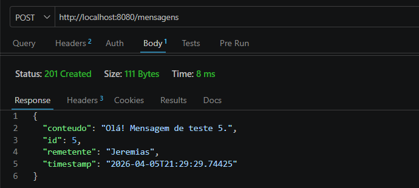
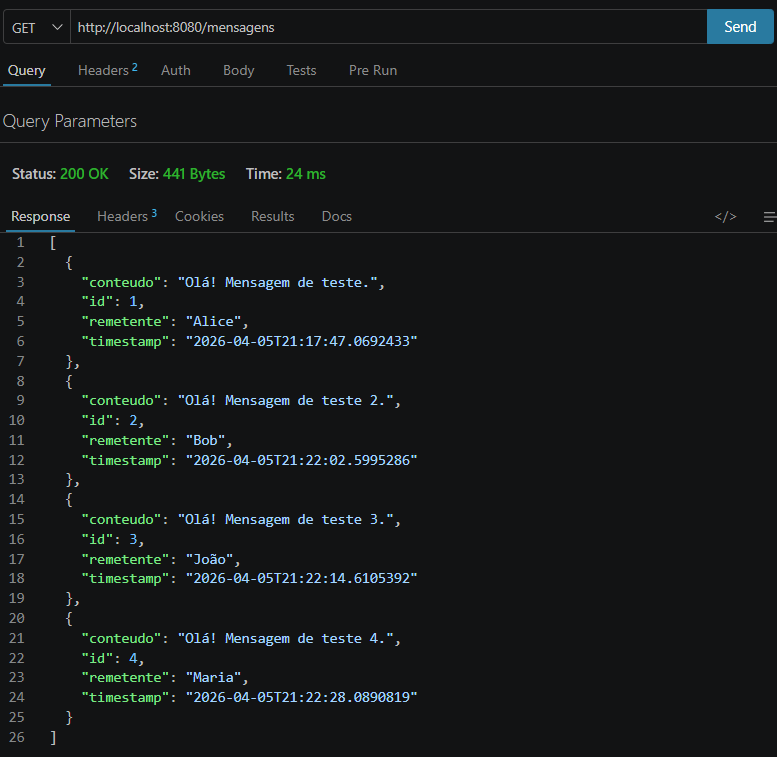
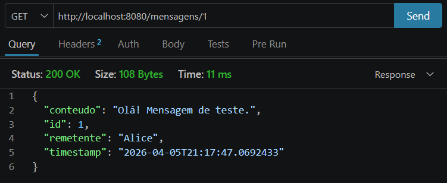
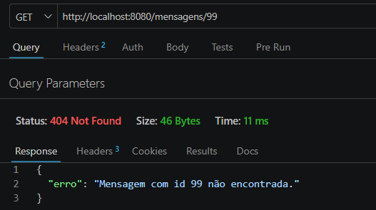
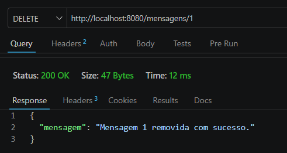
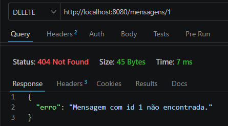

# Quarkus Mensagens — Relatório Técnico

Sistema REST simples construído com **Quarkus + JAX-RS (RESTEasy)** que simula a troca de mensagens entre processos distribuídos via protocolo HTTP.

---

## Estrutura do Projeto

```
http-quarkus/
├── pom.xml
└── src/
    └── main/
        ├── java/org/acme/mensagens/
        │   ├── Mensagem.java          ← modelo de dados
        │   └── MensagemResource.java  ← endpoints JAX-RS
        └── resources/
            └── application.properties
```

---

## Como Executar

**Pré-requisitos:** Java 17+, Maven 3.9+

```bash
# Clonar / entrar na pasta do projeto
cd http-quarkus

# Iniciar em modo dev (hot reload automático)
./mvnw quarkus:dev

# O servidor sobe em: http://localhost:8080
```

---

## 4.1 Arquitetura da Solução

### Fluxo de uma Requisição POST /mensagens

```
┌────────────────────────────────────────────────────────────────────┐
│  SENDER (Postman / qualquer cliente HTTP)                          │
│                                                                    │
│  POST http://localhost:8080/mensagens                              │
│  Content-Type: application/json                                    │
│  Body: { "remetente": "Alice", "conteudo": "Olá, mundo!" }        │
└──────────────────────────────┬─────────────────────────────────────┘
                               │ TCP/IP (Camada de Transporte)
                               │ HTTP encapsula o payload no body
                               ▼
┌────────────────────────────────────────────────────────────────────┐
│  RECEIVER (Quarkus — servidor HTTP embutido Vert.x)                │
│                                                                    │
│  1. Vert.x recebe os bytes TCP e reconstrói o envelope HTTP        │
│  2. RESTEasy interpreta o método + rota → chama enviarMensagem()   │
│  3. Jackson desserializa o JSON → objeto Mensagem                  │
│  4. Mensagem é salva na lista em memória com ID e timestamp        │
│  5. Resposta 201 Created + JSON do objeto criado é devolvida       │
└──────────────────────────────┬─────────────────────────────────────┘
                               │ HTTP Response
                               ▼
               Postman exibe: 201 Created + corpo JSON
```

**O HTTP encapsula o conteúdo da seguinte forma:**

```
POST /mensagens HTTP/1.1          ← linha de requisição (método + rota + versão)
Host: localhost:8080              ← cabeçalho obrigatório no HTTP/1.1
Content-Type: application/json    ← informa o formato do corpo
Content-Length: 47                ← tamanho do payload em bytes

{"remetente":"Alice","conteudo":"Olá!"}   ← corpo (payload da mensagem)
```

### Mapeamento Teórico: HTTP ↔ Send/Receive

No modelo clássico de comunicação entre processos, `send(destino, mensagem)` transmite dados e `receive(origem, mensagem)` os consome. O protocolo HTTP traduz esse modelo da seguinte forma:

| Operação Teórica | Método HTTP | Semântica |
|-----------------|-------------|-----------|
| **send** (criar/enviar dado) | `POST` | O cliente envia uma nova mensagem ao servidor. O servidor é o Receiver que a processa e persiste |
| **receive** (ler/consumir dado) | `GET` | O cliente solicita dados armazenados. O servidor age como Sender ao devolver o recurso |
| **send** (remover dado) | `DELETE` | O cliente envia uma instrução de remoção. O servidor executa e confirma |

O HTTP é **síncrono e orientado a requisição-resposta**: diferente de filas de mensagens (assíncrono), o Sender bloqueia até receber a confirmação do Receiver — comportamento análogo ao `send` bloqueante estudado em sistemas distribuídos.
---

## 4.2 Evidências de Funcionamento

### Endpoints Implementados

| Método | Rota | Descrição |
|--------|------|-----------|
| GET | `/mensagens` | Retorna todas as mensagens armazenadas |
| GET | `/mensagens/{id}` | Retorna uma mensagem pelo ID |
| POST | `/mensagens` | Envia (cria) uma nova mensagem |
| DELETE | `/mensagens/{id}` | Remove uma mensagem pelo ID |

---

### Tabela de Testes com Postman

#### 1. POST /mensagens — Criar mensagem

**Requisição:**
```
POST http://localhost:8080/mensagens
Content-Type: application/json

{
  "remetente": "Jeremias",
  "conteudo": "Olá! Mensagem de teste 5."
}
```

**Resposta esperada — `201 Created`:**
```json
{
  "conteudo": "Olá! Mensagem de teste 5.",
  "id": 5,
  "remetente": "Jeremias",
  "timestamp": "2026-04-05T21:29:29.74425"
}
```

> **Print:** 

---

#### 2. GET /mensagens — Listar todas

**Requisição:**
```
GET http://localhost:8080/mensagens
```

**Resposta esperada — `200 OK`:**
```json
[
  {
    "conteudo": "Olá! Mensagem de teste.",
    "id": 1,
    "remetente": "Alice",
    "timestamp": "2026-04-05T21:17:47.0692433"
  },
  {
    "conteudo": "Olá! Mensagem de teste 2.",
    "id": 2,
    "remetente": "Bob",
    "timestamp": "2026-04-05T21:22:02.5995286"
  },
  {
    "conteudo": "Olá! Mensagem de teste 3.",
    "id": 3,
    "remetente": "João",
    "timestamp": "2026-04-05T21:22:14.6105392"
  },
  {
    "conteudo": "Olá! Mensagem de teste 4.",
    "id": 4,
    "remetente": "Maria",
    "timestamp": "2026-04-05T21:22:28.0890819"
  }
]
```

> **Print:** 

---

#### 3. GET /mensagens/{id} — Buscar por ID existente

**Requisição:**
```
GET http://localhost:8080/mensagens/1
```

**Resposta esperada — `200 OK`:**
```json
{
  "id": 1,
  "remetente": "Alice",
  "conteudo": "Olá! Mensagem de teste.",
  "timestamp": "2026-05-04T10:30:00.123"
}
```

> **Print:** 

---

#### 4. GET /mensagens/{id} — ID inexistente

**Requisição:**
```
GET http://localhost:8080/mensagens/99
```

**Resposta esperada — `404 Not Found`:**
```json
{
  "erro": "Mensagem com id 99 não encontrada."
}
```

> **Print:**  

---

#### 5. DELETE /mensagens/{id} — Remover mensagem

**Requisição:**
```
DELETE http://localhost:8080/mensagens/1
```

**Resposta esperada — `200 OK`:**
```json
{
  "mensagem": "Mensagem 1 removida com sucesso."
}
```

> **Print:** 
_[inserir screenshot do Postman mostrando 200 OK]_

---

#### 6. DELETE /mensagens/{id} — ID inexistente após remoção

**Requisição:**
```
DELETE http://localhost:8080/mensagens/1
```

**Resposta esperada — `404 Not Found`:**
```json
{
  "erro": "Mensagem com id 1 não encontrada."
}
```

> **Print:** 

---

### Justificativa dos Status Codes

| Código | Nome | Quando é Retornado | Justificativa |
|--------|------|-------------------|---------------|
| `200 OK` | OK | GET bem-sucedido, DELETE bem-sucedido | A operação foi processada e o servidor devolve o recurso solicitado ou confirmação de remoção. Padrão RFC 9110 §15.3.1 |
| `201 Created` | Created | POST bem-sucedido | Um novo recurso foi criado no servidor. Semanticamente mais preciso que 200 para criação — indica ao cliente que o estado do servidor mudou. Padrão RFC 9110 §15.3.2 |
| `404 Not Found` | Not Found | GET ou DELETE com ID inexistente | O servidor não encontrou o recurso identificado. Evita expor detalhes internos — o cliente sabe apenas que o recurso não existe. Padrão RFC 9110 §15.5.5 |
| `400 Bad Request` | Bad Request | POST com campos obrigatórios ausentes | A requisição está malformada do lado do cliente (remetente ou conteúdo nulos). Padrão RFC 9110 §15.5.1 |

> Referência dos status codes: [RFC 9110 — HTTP Semantics (IETF)](https://www.rfc-editor.org/rfc/rfc9110)

---

## Referências

- Quarkus — Documentação oficial: https://quarkus.io/guides/rest
- JAX-RS (Jakarta RESTful Web Services): https://jakarta.ee/specifications/restful-ws/
- RFC 9110 — HTTP Semantics: https://www.rfc-editor.org/rfc/rfc9110
- Tanenbaum, A. S.; Van Steen, M. *Distributed Systems: Principles and Paradigms*. 3ª ed., 2017 — Capítulo 4 (Communication)
